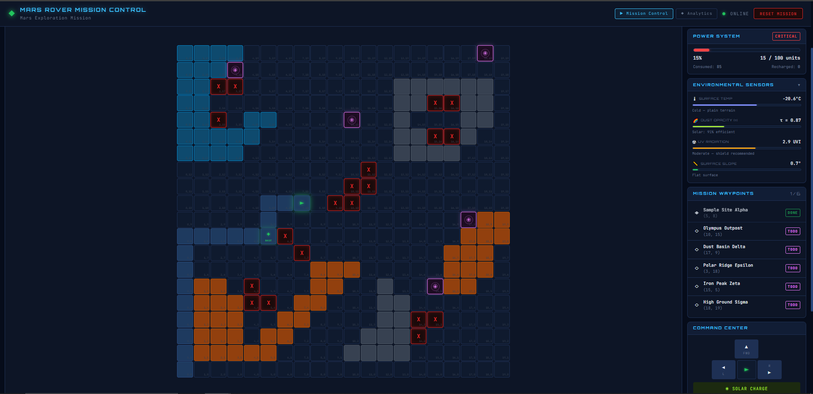

# 🚀 Mars Rover Mission Control

A progressive Mars Rover simulation built across three phases — from clean OOP terminal simulation to a full interactive web-based mission control dashboard. Built for learning, portfolio visibility, and showcasing the intersection of **Astronomy + Software Engineering**.


[](https://www.python.org/)
[](https://flask.palletsprojects.com/)
[](https://choosealicense.com/licenses/mit/)

---

## 🌐 Web Mission Control (Phase 3)

> Control the rover directly from your browser — terrain-aware, battery-powered, A\* navigated.


<!--  -->

---

## 📋 Table of Contents

1. [Project Evolution](#project-evolution)
2. [Features](#features)
3. [Project Structure](#project-structure)
4. [Getting Started](#getting-started)
5. [Usage](#usage)
6. [Architecture](#architecture)
7. [Configuration](#configuration)
8. [Testing](#testing)
9. [Design Patterns](#design-patterns)
10. [Astronomy Connection](#astronomy-connection)

---

## 🧬 Project Evolution

This project was built in three deliberate phases, each adding a meaningful layer on top of the last:

| Phase | What was built | Key concepts |
|---|---|---|
| **Phase 1** | OOP core, Rich terminal UI, YAML config, telemetry | Strategy Pattern, Command Pattern, ABCs |
| **Phase 2** | A\* pathfinding, battery system, terrain types, waypoints | Graph search, energy modelling, inheritance |
| **Phase 3** | Flask REST API, interactive browser UI, analytics dashboard, batch commands | Client-server, reactive rendering, persistent telemetry |

---

## ✨ Features

### Phase 1 — Core Simulation
- **Grid-based navigation** with obstacle detection and boundary validation
- **Rich terminal UI** — color-coded grid, path trail, and live status tables
- **YAML configuration** — customize grid, obstacles, and rover start without touching code
- **Telemetry logging** — every mission exported to JSON automatically
- **24 unit tests** with pytest

### Phase 2 — Advanced Simulation
- **A\* Pathfinding** — shortest obstacle-free path using Manhattan distance heuristic
- **Battery system** — energy drains on every move based on terrain type, solar recharge available
- **Terrain types** — Plain, Sand, Rock, Ice each with distinct battery costs
- **Mission waypoints** — named science targets tracked and marked on the grid
- **38 unit tests** covering all Phase 2 systems

### Phase 3 — Web Visualization, Analytics & Sensor Systems
- **Interactive browser UI** — full mission control dashboard at `http://localhost:5000`
- **Live CSS grid** — terrain colors, glowing rover arrow, obstacles, waypoint beacons, path trail
- **Pulsing waypoint beacons** — animated landing zone rings; glowing "BASE ✦" marker when reached
- **Animated battery bar** — color shifts green → yellow → red in real time
- **D-pad + keyboard controls** — W/A/D/E for Move/Left/Right/Solar
- **Click-to-navigate** — click any grid cell to auto A\* navigate there
- **Batch command runner** — type commands or upload a `.txt` file; step-through animation mode
- **Analytics dashboard** — Chart.js battery timeline, command distribution, terrain coverage, path heatmap
- **Mission Replay** — load any saved mission and watch it animate step-by-step with full playback controls
- **Environmental Sensor Dashboard** — live REMS-style gauges: surface temperature, dust opacity (τ), UV index, slope
- **Dust-aware solar charging** — high atmospheric τ reduces solar yield by up to 50%
- **Persistent telemetry** — every web session auto-saved to `telemetry/` as a JSON file with sensor snapshots
- **Navigation between pages** — Mission Control ↔ Analytics via top nav

---

## 📁 Project Structure

```
Mars_Rover_Exercise/
│
├── rover.py                  # Phase 1 core (OOP, terminal, telemetry)
├── config.yaml               # Shared mission configuration
├── requirements.txt          # Python dependencies
│
├── phase2/                   # Phase 2 — Advanced simulation modules
│   ├── main.py               # Phase 2 terminal entry point
│   ├── pathfinder.py         # A* search algorithm
│   ├── battery.py            # Energy / battery system
│   ├── terrain.py            # Terrain types and cost map
│   └── mission.py            # Mission objectives and waypoints
│
├── web/                      # Phase 3 — Web visualization
│   ├── app.py                # Flask server + REST API + telemetry persistence
│   ├── templates/
│   │   ├── index.html        # Mission Control single-page app
│   │   └── analytics.html    # Analytics dashboard page
│   └── static/
│       ├── style.css         # Dark space theme + batch panel styles
│       ├── app.js            # Grid renderer + API client + batch logic
│       ├── analytics.css     # Analytics dashboard styles
│       └── analytics.js      # Chart.js charts + heatmap renderer
│
├── tests/                    # All unit tests
│   ├── test_phase1.py        # 24 Phase 1 tests
│   └── test_phase2.py        # 38 Phase 2 tests
│
├── demo/                     # Automated demo scripts
│   ├── demo_phase1.py
│   └── demo_phase2.py
│
├── docs/                     # Per-phase documentation
│   ├── README_Phase1.md
│   └── README_Phase2.md
│
└── telemetry/                # Auto-generated mission JSON logs (all sessions)
```

---

## 🚀 Getting Started

### Prerequisites
- Python 3.8+
- pip

> **Note for Windows users:** Avoid using the Microsoft Store Python. Use python.org or a virtual environment to ensure packages install correctly.

### Installation

```bash
git clone https://github.com/your_username/Mars_Rover_Exercise.git
cd Mars_Rover_Exercise
pip install -r requirements.txt
```

**Dependencies:**
- `rich` — terminal UI (Phase 1 & 2)
- `pyyaml` — YAML config loading
- `flask` — web server (Phase 3)
- `pytest` — test framework

---

## 🎮 Usage

### Phase 3 — Web Mission Control *(recommended)*

```bash
python web/app.py
```

Open **http://localhost:5000** in your browser.

#### Mission Control Controls

| Control | Action |
|---|---|
| Click any grid cell | A\* auto-navigate to that cell |
| `W` / FWD button | Move forward |
| `A` / `D` buttons | Turn left / right |
| `E` / ☀ button | Solar charge (restore battery) |
| Type X, Y + **A\* GO** | Navigate to specific coordinates |
| **RESET MISSION** | Restart mission from `config.yaml` |

#### Batch Command Panel

Open the **BATCH COMMANDS** panel in the sidebar to run sequences of commands.

| Input mode | How to use |
|---|---|
| Text input | Type commands directly: `M M R M L G 5,7 S` |
| File upload | Drag & drop a `.txt` file or click to browse |
| Template | Click **Download sample template** for the correct format |

**Command format:**

| Command | Description |
|---|---|
| `M` | Move forward (uses battery) |
| `L` | Turn left 90° |
| `R` | Turn right 90° |
| `S` | Solar charge |
| `G x,y` | A\* navigate to coordinates e.g. `G 5,7` |
| `#` | Comment — ignored |

Use **STEP MODE** to animate through each command with a configurable speed slider.

#### Analytics Dashboard

Open **http://localhost:5000/analytics** or click the **Analytics** nav link.

- Select any saved mission from the dropdown
- View battery timeline, command mix, terrain coverage, and path heatmap
- Compare all missions in the history table
- Click **▶ REPLAY** (or the ▶ button on any table row) to open the Mission Replay panel

> Telemetry is saved automatically after every command, navigation, and batch run. Clicking **Refresh** fetches the latest records including your current session.

#### Mission Replay

Select any mission → click **▶ REPLAY** in the selector bar (or the ▶ button in any table row).

| Control | Action |
|---|---|
| `⏮` | Jump to mission start |
| `◀` | Step back one frame |
| `▶ / ⏸` | Play / Pause auto-playback |
| `▶` | Step forward one frame |
| `⏭` | Jump to mission end |
| Scrubber bar | Drag to any frame instantly |
| Speed slider | 100 ms (fast) → 2000 ms (slow) |

The replay grid shows terrain, obstacles, rover arrow, path trail building progressively, and waypoints lighting up the moment they are reached. The live telemetry sidebar shows battery, position, direction, and waypoint status for each frame.

#### Environmental Sensor Dashboard

The **ENVIRONMENTAL SENSORS** panel appears in the Mission Control sidebar between the battery panel and waypoints. Click the header to collapse or expand it.

| Sensor | What it measures | Real parallel |
|---|---|---|
| 🌡 **Surface Temp** | Terrain-based temperature (−80°C ice → +15°C sand) ± 3°C noise | Curiosity REMS thermometer |
| 🌪 **Dust Opacity (τ)** | Atmospheric dust — higher toward grid edges (dust storm zones) | Daily τ readings from Mars weather reports |
| ☢ **UV Radiation** | UV index increases with Y position (higher ground = thinner atmosphere) | Curiosity REMS UV sensor |
| 📐 **Surface Slope** | Terrain-based slope estimate (Rock ~18°, Plain ~2°) ± 1.5° noise | IMU tilt sensor on Perseverance |

**Dust effect on solar charging:** When τ ≥ 0.5, the `S` (Solar Charge) command yields less energy — linearly reduced up to **−50%** at τ = 2.5. The mission log shows exactly how much dust reduced the yield (e.g. `Solar charge (τ=1.8, -32% dust) — +3 units`).

---

### Phase 2 — Terminal Simulation

```bash
python phase2/main.py
```

| Command | Description |
|---|---|
| `M` | Move forward (drains battery by terrain cost) |
| `L` / `R` | Turn left / right |
| `S` | Solar charge |
| `G x,y` | A\* auto-navigate to (x, y) |
| `Q` | Quit and show mission summary |

---

### Phase 1 — Terminal Simulation (original)

```bash
python rover.py
```

---

### Automated Demos

```bash
python demo/demo_phase1.py   # Phase 1 scripted walkthrough
python demo/demo_phase2.py   # Full Phase 2 demo (A*, terrain, battery, waypoints)
```

---

## 🏗️ Architecture

### System Overview

```
Browser (HTML + CSS + JS)
     │  fetch() / REST API calls
     ▼
Flask Server  (web/app.py)
     │  ├─ Serves pages (/ and /analytics)
     │  ├─ REST API endpoints
     │  └─ Writes telemetry/*.json after every action
     │
     │  Python calls
     ▼
Phase 2 Engine  (phase2/)
     │  inherits from
     ▼
Phase 1 Core  (rover.py)
```

### Web API Contract

#### Mission Control

| Endpoint | Method | Purpose |
|---|---|---|
| `/` | GET | Serve the Mission Control page |
| `/api/state` | GET | Full rover state as JSON |
| `/api/command` | POST | Execute `M` / `L` / `R` / `S` |
| `/api/navigate` | POST | A\* navigate to `{x, y}` |
| `/api/reset` | POST | Save current session, reset mission |

#### Batch

| Endpoint | Method | Purpose |
|---|---|---|
| `/api/batch/execute` | POST | Run a list of commands, return all step states |
| `/api/batch/template` | GET | Download sample `.txt` command file |

#### Analytics

| Endpoint | Method | Purpose |
|---|---|---|
| `/analytics` | GET | Serve the Analytics dashboard |
| `/api/analytics/missions` | GET | List all telemetry files with metadata |
| `/api/analytics/mission/<file>` | GET | Full breakdown for one mission |

### Telemetry Persistence

Every web session generates one `telemetry/mission_YYYYMMDD_HHMMSS.json` file that follows the exact same schema as the terminal-generated files. Sensor readings are embedded in every event:

```json
{
  "mission_name": "Mars Exploration Mission",
  "start_time":   "2026-05-28T19:00:00",
  "end_time":     "2026-05-28T19:15:43",
  "final_status": { "position": {}, "direction": "", "battery": {} },
  "path_history": [[0,0], [0,1], "..."],
  "events": [
    { "timestamp": "...", "type": "mission_start", "data": { "battery": {}, "position": {} } },
    { "timestamp": "...", "type": "command", "data": {
        "command": "M",
        "rover_status": {},
        "mission_status": {},
        "sensors": {
          "surface_temp": -22.4,
          "dust_opacity": 0.87,
          "uv_index": 2.1,
          "slope_deg": 3.2,
          "solar_reduction_pct": 9.3
        }
    }},
    { "timestamp": "...", "type": "solar_charge", "data": { "gained": 3, "battery": {}, "sensors": {} } }
  ]
}
```

The file is **overwritten after every action** so it always reflects the latest state. On reset, the old file is finalized and a new session begins.

### Core Classes

```
Direction (ABC)
├── North / East / South / West          ← Strategy Pattern

Command (ABC)
├── MoveForward / TurnLeft / TurnRight   ← Command Pattern

Grid          → grid dimensions + obstacle tracking
Rover         → position, direction, path history
 └── RoverV2  → + battery + terrain-aware movement (Template Method)

Battery       → charge level, drain, dust-aware solar recharge
TerrainMap    → per-cell terrain type and battery cost mapping
Mission       → waypoint list + completion tracking
Pathfinder    → A* search with Manhattan heuristic (static methods)
SensorSimulator → REMS-style environmental readings (temperature,
                  dust opacity, UV index, slope) per grid position
```

---

## ⚙️ Configuration

All mission parameters live in `config.yaml` — no code changes needed:

```yaml
grid:
  width: 10
  height: 10
  obstacles:
    - [2, 2]
    - [3, 5]
    - [7, 8]

rover:
  start_x: 0
  start_y: 0
  start_direction: "N"   # N | S | E | W

battery:
  max_charge: 100
  solar_rate: 5          # units restored per solar charge action

terrain:
  - type: sand           # plain | sand | rock | ice
    cells:
      - [1, 1]
      - [2, 1]
  - type: rock
    cells:
      - [6, 4]

mission:
  name: "Mars Exploration Mission"
  enable_telemetry: true
  telemetry_folder: "telemetry"
  waypoints:
    - name: "Sample Site Alpha"
      x: 5
      y: 7
    - name: "High Ground Sigma"
      x: 9
      y: 9
```

### Terrain Battery Costs

| Terrain | Cost per move |
|---|---|
| Plain | 5 units |
| Sand | 10 units |
| Rock | 15 units |
| Ice | 3 units |

---

## 🧪 Testing

```bash
# All 62 tests (Phase 1 + Phase 2)
pytest tests/ -v

# Phase 1 only (24 tests)
pytest tests/test_phase1.py -v

# Phase 2 only (38 tests)
pytest tests/test_phase2.py -v
```

**Coverage:** Directions, Grid, Rover, Commands, Battery, Terrain, Mission, A\* Pathfinder, RoverV2 integration.

---

## 🎨 Design Patterns

| Pattern | Where used |
|---|---|
| **Strategy** | `Direction` classes — each encapsulates movement + rotation logic |
| **Command** | `MoveForward` / `TurnLeft` / `TurnRight` — rover actions as objects |
| **Template Method** | `RoverV2.move_forward()` overrides `Rover.move_forward()` to add battery drain |
| **Factory / Class Method** | `TerrainMap.from_config()`, `Mission.from_config()` — construct from YAML |

---

## 🌌 Astronomy Connection

> This simulation mirrors real Mars rover mission concepts:
>
> - **Battery management** — Perseverance uses an MMRTG power system with finite energy budgets per sol
> - **Terrain-aware navigation** — NASA's AEGIS AI selects paths by terrain difficulty and science value
> - **Waypoints** — Mission controllers uplink daily drive plans with named science target coordinates
> - **A\* pathfinding** — AutoNav uses stereo-vision + graph search to autonomously avoid hazards
> - **Telemetry** — Every rover sends continuous status packets; ground teams replay sessions for analysis
> - **REMS sensors** — Curiosity's weather station measures temperature, UV, and atmospheric dust (τ) daily
> - **Dust storms** — High τ events reduce solar panel efficiency; NASA plans conservative power budgets around them
> - **Mission replay** — JPL engineers replay telemetry recordings to diagnose rover behaviour and plan corrections

---

## 📝 License

MIT License — see [choosealicense.com](https://choosealicense.com/licenses/mit/) for details.

---

**Built with passion for Astronomy + Engineering 🚀🔴**
