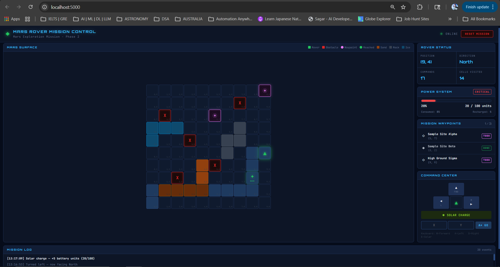

# 🚀 Mars Rover Mission Control

A progressive Mars Rover simulation built across three phases — from clean OOP terminal simulation to a full interactive web-based mission control dashboard. Built for learning, portfolio visibility, and showcasing the intersection of **Astronomy + Software Engineering**.


[](https://www.python.org/)
[](https://flask.palletsprojects.com/)
[](https://choosealicense.com/licenses/mit/)

---

## 🌐 Web Mission Control (Phase 3)

> Control the rover directly from your browser — terrain-aware, battery-powered, A\* navigated.




---

## 📋 Table of Contents

1. [Project Evolution](#project-evolution)
2. [Features](#features)
3. [Project Structure](#project-structure)
4. [Getting Started](#getting-started)
5. [Usage](#usage)
6. [Architecture](#architecture)
7. [Configuration](#configuration)
8. [Testing](#testing)
9. [Design Patterns](#design-patterns)

---

## 🧬 Project Evolution

This project was built in three deliberate phases, each adding a meaningful layer:

| Phase | What was built | Key concepts |
|---|---|---|
| **Phase 1** | OOP core, Rich terminal UI, YAML config, telemetry | Strategy Pattern, Command Pattern, ABCs |
| **Phase 2** | A\* pathfinding, battery system, terrain, waypoints | Graph search, energy modelling, inheritance |
| **Phase 3** | Flask web server, interactive browser UI | REST API, client-server, reactive rendering |

---

## ✨ Features

### Phase 1 — Core Simulation
- **Grid-based navigation** with obstacle detection and boundary validation
- **Rich terminal UI** with color-coded grid, path trail, and status tables
- **YAML configuration** — customize grid, obstacles, and rover start without touching code
- **Telemetry logging** — every mission exported to JSON for analysis
- **24 unit tests** with pytest

### Phase 2 — Advanced Simulation
- **A\* Pathfinding** — shortest obstacle-free path with Manhattan heuristic
- **Battery system** — energy drains on every move (terrain-dependent), solar recharge available
- **Terrain types** — Plain, Sand, Rock, Ice each with different battery costs
- **Mission waypoints** — named science targets tracked across the grid
- **38 unit tests** covering all new systems

### Phase 3 — Web Visualization
- **Interactive browser UI** — full mission control dashboard at `http://localhost:5000`
- **Live CSS grid** — terrain colors, rover arrow, obstacles, waypoint beacons, path trail
- **Pulsing waypoint beacons** — animated landing zone markers; "BASE" star when reached
- **Animated battery bar** — color shifts green → yellow → red in real time
- **D-pad + keyboard controls** — W/A/D/E for Move/Left/Right/Solar
- **Click-to-navigate** — click any grid cell to auto A\* navigate there
- **Mission log feed** — color-coded event stream
- **REST API** — clean 5-endpoint Flask server, JSON state contract

---

## 📁 Project Structure

```
Mars_Rover_Exercise/
│
├── rover.py                  # Phase 1 core (OOP, terminal, telemetry)
├── config.yaml               # Shared mission configuration
├── requirements.txt          # Python dependencies
│
├── phase2/                   # Phase 2 — Advanced simulation modules
│   ├── main.py               # Phase 2 terminal entry point
│   ├── pathfinder.py         # A* search algorithm
│   ├── battery.py            # Energy / battery system
│   ├── terrain.py            # Terrain types and cost map
│   └── mission.py            # Mission objectives and waypoints
│
├── web/                      # Phase 3 — Web visualization
│   ├── app.py                # Flask server + REST API
│   ├── templates/
│   │   └── index.html        # Single-page app shell
│   └── static/
│       ├── style.css         # Dark space theme
│       └── app.js            # Grid renderer + API client
│
├── tests/                    # All unit tests
│   ├── test_phase1.py        # 24 Phase 1 tests
│   └── test_phase2.py        # 38 Phase 2 tests
│
├── demo/                     # Automated demo scripts
│   ├── demo_phase1.py
│   └── demo_phase2.py
│
├── docs/                     # Per-phase documentation
│   ├── README_Phase1.md
│   └── README_Phase2.md
│
└── telemetry/                # Auto-generated mission JSON logs
```

---

## 🚀 Getting Started

### Prerequisites
- Python 3.8+
- pip

### Installation

```bash
git clone https://github.com/your_username/Mars_Rover_Exercise.git
cd Mars_Rover_Exercise
pip install -r requirements.txt
```

**Dependencies:**
- `rich` — terminal UI (Phase 1 & 2)
- `pyyaml` — YAML config loading
- `flask` — web server (Phase 3)
- `pytest` — test framework

---

## 🎮 Usage

### Phase 3 — Web Mission Control *(recommended)*

```bash
python web/app.py
```

Open **http://localhost:5000** in your browser.

| Control | Action |
|---|---|
| Click grid cell | A\* navigate to that cell |
| `W` / FWD button | Move forward |
| `A` / `D` buttons | Turn left / right |
| `E` / ☀ button | Solar charge (restore battery) |
| Type X,Y + A\* GO | Navigate to specific coordinates |
| RESET MISSION | Restart from config |

---

### Phase 2 — Terminal Simulation

```bash
python phase2/main.py
```

| Command | Description |
|---|---|
| `M` | Move forward (drains battery by terrain cost) |
| `L` / `R` | Turn left / right |
| `S` | Solar charge |
| `G x,y` | A\* auto-navigate to (x,y) |
| `Q` | Quit and show summary |

---

### Phase 1 — Terminal Simulation (original)

```bash
python rover.py
```

---

### Automated Demos

```bash
python demo/demo_phase1.py   # Phase 1 scripted run
python demo/demo_phase2.py   # Phase 2 scripted run (A*, terrain, waypoints)
```

---

## 🏗️ Architecture

### System Overview

```
Browser (HTML/CSS/JS)
     │  fetch / REST API
     ▼
Flask Server (web/app.py)
     │  Python calls
     ▼
Phase 2 Engine (phase2/)
     │  inherits from
     ▼
Phase 1 Core (rover.py)
```

### Web API Contract

| Endpoint | Method | Purpose |
|---|---|---|
| `/` | GET | Serve the single-page app |
| `/api/state` | GET | Full rover state as JSON |
| `/api/command` | POST | Execute M / L / R / S |
| `/api/navigate` | POST | A\* navigate to `{x, y}` |
| `/api/reset` | POST | Reset mission from config |

### Core Classes

```
Direction (ABC)
├── North / East / South / West     ← Strategy Pattern

Command (ABC)
├── MoveForward / TurnLeft / TurnRight   ← Command Pattern

Grid          → dimensions + obstacles
Rover         → position, direction, path history
 └── RoverV2  → + battery + terrain (Phase 2, Template Method)

Battery       → charge, drain, solar recharge
TerrainMap    → per-cell terrain type and battery cost
Mission       → waypoints + completion tracking
Pathfinder    → A* search (static methods)
```

---

## ⚙️ Configuration

All mission parameters live in `config.yaml` — no code changes needed:

```yaml
grid:
  width: 10
  height: 10
  obstacles:
    - [2, 2]
    - [3, 5]

rover:
  start_x: 0
  start_y: 0
  start_direction: "N"   # N | S | E | W

battery:
  max_charge: 100
  solar_rate: 5          # units recharged per solar action

terrain:
  - type: sand           # plain | sand | rock | ice
    cells:
      - [1, 1]
      - [2, 1]

mission:
  name: "Mars Exploration Mission"
  waypoints:
    - name: "Sample Site Alpha"
      x: 5
      y: 7
```

### Terrain Battery Costs

| Terrain | Cost per move |
|---|---|
| Plain | 5 units |
| Sand | 10 units |
| Rock | 15 units |
| Ice | 3 units |

---

## 🧪 Testing

```bash
# All 62 tests (Phase 1 + Phase 2)
pytest tests/ -v

# Phase 1 only (24 tests)
pytest tests/test_phase1.py -v

# Phase 2 only (38 tests)
pytest tests/test_phase2.py -v
```

**Coverage:** Directions, Grid, Rover, Commands, Battery, Terrain, Mission, A\* Pathfinder, RoverV2 integration.

---

## 🎨 Design Patterns

| Pattern | Where used |
|---|---|
| **Strategy** | Direction classes — each encapsulates movement + turn logic |
| **Command** | MoveForward / TurnLeft / TurnRight — actions as objects |
| **Template Method** | RoverV2 overrides `move_forward()` from Rover |
| **Factory / Class Method** | `TerrainMap.from_config()`, `Mission.from_config()` |

---

## 🌌 Astronomy Connection

> This simulation mirrors real Mars rover mission concepts:
>
> - **Battery management** — Perseverance uses an MMRTG power system with finite energy budgets
> - **Terrain-aware navigation** — NASA's AEGIS AI selects paths based on terrain difficulty
> - **Waypoints** — Mission controllers uplink daily drive plans with science target coordinates
> - **A\* pathfinding** — AutoNav uses stereo-vision + graph search to avoid hazards autonomously

---

## 📝 License

MIT License — see [choosealicense.com](https://choosealicense.com/licenses/mit/) for details.

---

**Built with passion for Astronomy + Engineering 🚀🔴**
